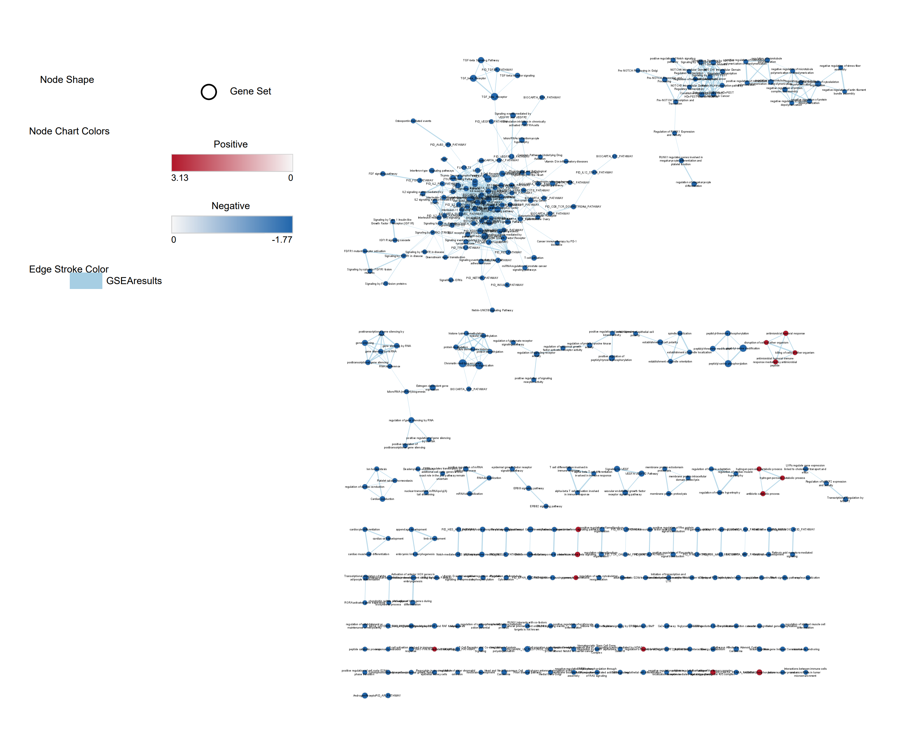
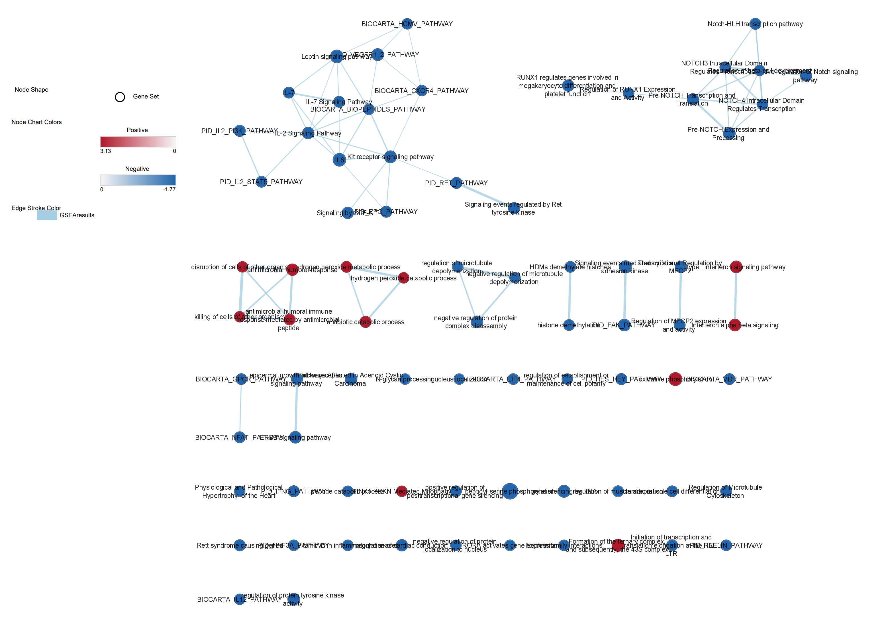
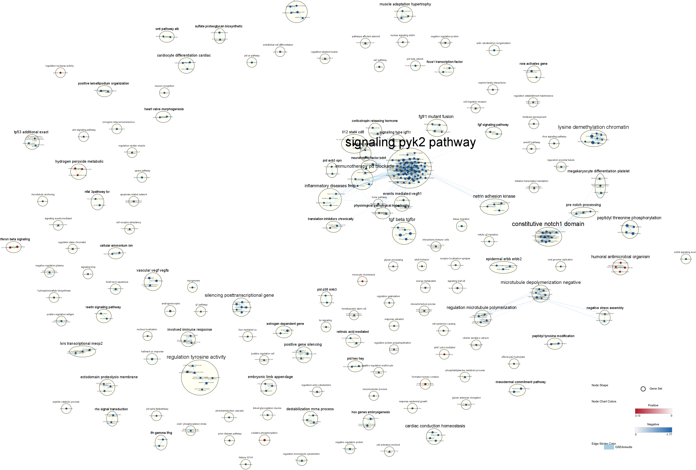
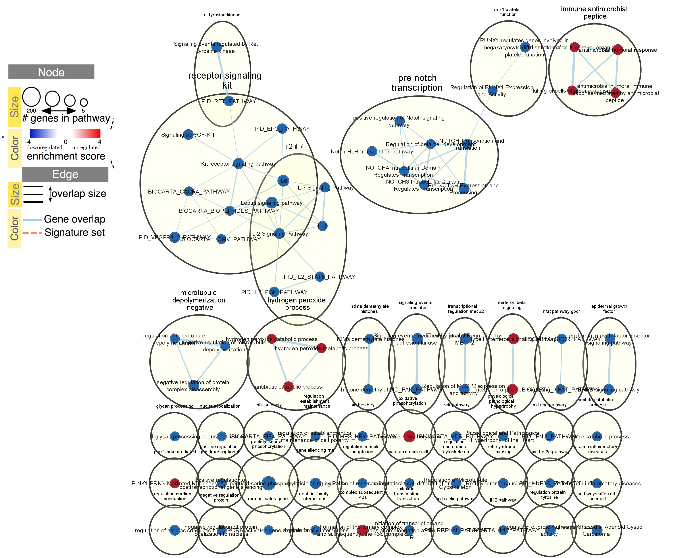

Install packages & load libraries necessary.
```{r message = FALSE, echo = FALSE}
if (!requireNamespace("BiocManager", quietly = TRUE))
    install.packages("BiocManager")
if (!requireNamespace("GEOmetadb", quietly = TRUE))
    BiocManager::install("GEOmetadb")
if (!requireNamespace("gridExtra", quietly = TRUE))
    install.packages("gridExtra")
if (!requireNamespace("org.Hs.eg.db", quietly = TRUE))
    BiocManager::install("org.Hs.eg.db")
if (!requireNamespace("knitr", quietly = TRUE))
    install.packages("knitr")
if (!requireNamespace("biomaRt", quietly = TRUE))
    BiocManager::install("biomaRt")
if (!requireNamespace("edgeR", quietly = TRUE))
    BiocManager::install("edgeR")
if (!requireNamespace("RSQLite", quietly = TRUE))
    install.packages("RSQLite")
if (!requireNamespace("dplyr", quietly = TRUE))
    install.packages("dplyr")
if (!requireNamespace("tibble", quietly = TRUE))
    install.packages("tibble")
if (!requireNamespace("ComplexHeatmap", quietly = TRUE))
    install.packages("ComplexHeatmap")
if (!requireNamespace("circlize", quietly = TRUE))
    install.packages("circlize")
if (!requireNamespace("kableExtra", quietly = TRUE))
    BiocManager::install("kableExtra")
if (!requireNamespace("stringr", quietly = TRUE))
    install.packages("stringr")
if (!requireNamespace("utils", quietly = TRUE))
    install.packages("utils")
if (!requireNamespace("RCurl", quietly = TRUE))
    install.packages("RCurl")
if (!requireNamespace("GSA", quietly = TRUE))
    install.packages("GSA")
if (!requireNamespace("VennDiagram", quietly = TRUE))
    install.packages("VennDiagram")
library(edgeR)
library(gridExtra)
library(knitr)
library(GEOmetadb)
library(biomaRt)
library(org.Hs.eg.db)
library(RSQLite)
library(magrittr)
library(dplyr)
library(tibble)
library(ComplexHeatmap)
library(circlize)
library(kableExtra)
library(stringr)
library(utils)
library(RCurl)
library(GSA)
library(VennDiagram)
```

## Recap of A1

The Expression Dataset I chose was [GSE97356: Gene expression associated with PTSD in World Trade Center responders: An RNA sequencing study](https://www.ncbi.nlm.nih.gov/geo/query/acc.cgi?acc=GSE97356).


**A bit about the dataset**

```{r message = FALSE}
gse <- getGEO("GSE97356",GSEMatrix=FALSE)
```

Dataset details:

```{r echo = FALSE, results = TRUE, message = FALSE}
data.frame(head(Meta(gse)))
```

Dataset platform details:

```{r echo = FALSE, message = FALSE}
currentGpl <- names(GPLList(gse))[1]
currentGplInfo <- Meta(getGEO(currentGpl))
```
**Name of Platform:** `r currentGplInfo$title`

**Submission Data Date:** `r currentGplInfo$submission_date`

**Last Date Data was Updated:** `r currentGplInfo$last_update_date`

**Organisms Included in Platform:** `r currentGplInfo$organism`

**Quantity of GEO datasets that use this Platform:** `r length(currentGplInfo$series_id)`

**Quantity of GEO samples that use this Platform:** `r length(currentGplInfo$sample_id)`


**Clean the Data and Map to HUGO Symbols**


```{r message = FALSE}
if(!file.exists('GEOmetadb.sqlite')) getSQLiteFile()
con <- dbConnect(SQLite(),'GEOmetadb.sqlite')
sfiles <- getGEOSuppFiles('GSE97356')
fnames = rownames(sfiles) 
reads = read.delim(fnames[1],header=TRUE,sep = ",")
#rename first column to genes, as it's more meaningful than X
colnames(reads)[1] <- c("Gene")
```
The dimensions of my dataset are: `r dim(reads)`

This means there are 25830 rows and 325 columns (the rows indicate genes and the columns are samples, ignoring the first column which delimits that the rows are genes).

I have three kinds of samples in my 324 subjects, based on the study design. The study design says "324 human samples; 201 never, 82 current, 41 past with PTSD". I want to get a list of which subjects have never/current/past PTSD diagnosis to compare to my reads dataframe. 

```{r message = FALSE}
for(i in 1:324) {
    status <- gse@gsms[[i]]@header["characteristics_ch1"][[1]][1]
    case <- gse@gsms[[i]]@header["title"]
    if(i==1){
        metainfo <- data.frame("status"= status, "case" = case)
    }
    else{
        currentMetainfo <- data.frame("status"= status, "case" = case)
        metainfo <- rbind(metainfo, currentMetainfo)
    }
}
#for a sanity check ensure correct number of subjects with current/never/past PTSD diagnosis
occurences<-table(unlist(metainfo$status))
print(occurences)
```

The metainformation found in the gse shows `r occurences[1]` subjects with current PTSD, `r occurences[2]` subjects who never had PTSD, and `r occurences[3]` who had past PTSD diagnosis. This doesn't match the study design... but I looked at the paper and the published paper shows: "201 with never, 81 current, 42 past PTSD", so we are actually correctly parsing the data, the study design is incorrectly labelled on GEO.


**Filter weakly expressed features from my dataset**

I'm going to filter lowly expressed genes using edgeR. Since I am keeping the genes that have at least 1 count per million within smallest group sample size, which is 42 (past PTSD), I'm looking for genes that have at least 1 count per million at least 42 times. 
```{r message = FALSE}
cpms = cpm(reads[,2:325])
#add in the genes associated with rownames
rownames(cpms) <- reads[,1]
qualityReads = rowSums(cpms >1) >= 42
filteredReads = reads[qualityReads,]
```

The filtered dimensions of the dataset now are: `r dim(filteredReads)`.

During filtering we removed `r dim(reads)[1] -  dim(filteredReads)[1]` genes.

**Checking for duplicates after filtering**

I'm going to see if the dataset has duplicates:
```{r message = FALSE}
filteredReadsDf <- data.frame(table(filteredReads$Gene))
colnames(filteredReadsDf) <- c("Gene", "GeneOccurence")
duplicates <- filteredReadsDf %>% filter(GeneOccurence > 1)
```

It looks like I don't have any duplicated gene names, the number of duplicated gene names is `r sum(filteredReadsDf$GeneOccurence > 1)` .

Let's take a look at how the gene names are stored:
```{r message = FALSE}
head(filteredReadsDf$Gene, 5)
```

Looking at gene AADACL2-AS1 for example, I see it is AADACL2 Antisense RNA 1. These appear to be gene ids, but I want to convert to HUGO symbols. I'm going to see if I can find the corresponding ensembl ids.


**Mapping to Ensembl Ids**

```{r message = FALSE}
grch37 <- useMart(biomart="ENSEMBL_MART_ENSEMBL", host="grch37.ensembl.org", path="/biomart/martservice") #from https://support.bioconductor.org/p/62064/
ensembl_grch37 = useDataset("hsapiens_gene_ensembl",mart=grch37)
idToEnsembl <- getBM(attributes = c("wikigene_name", "ensembl_gene_id"),
               filters = c("wikigene_name"),
               values = filteredReads$Gene,
               mart = ensembl_grch37)
```
I can see that I have `r sum(idToEnsembl$ensembl_gene_id == "")` gene ids that do not map to ensembl ids, so I'm not concerned. I'm now going to convert the ensembl ids to HUGO symbols. 

**Mapping to HUGO symbols**

```{r message = FALSE}
#first add the ensembl id labels to filteredReads
colnames(idToEnsembl) <- c("Gene", "EnsemblId")
filteredReads <- merge(idToEnsembl, filteredReads, by="Gene")
#now lets get the corresponding HUGO symbols
ensemblToHUGO <- getBM(attributes = c("ensembl_gene_id","hgnc_symbol"),
                   filters = c("ensembl_gene_id"),
                   values = filteredReads$EnsemblId,
                   mart = ensembl_grch37)
```

Now I have `r sum(ensemblToHUGO$hgnc_symbol == "")` ensembl ids that do not map to HUGO symbols. Lets see how many ensembl ids are duplicated.

**Checking for duplicates in Ensembl Ids**

```{r message = FALSE}
filteredReadsDfEnsembl <- data.frame(table(filteredReads$EnsemblId))
colnames(filteredReadsDfEnsembl) <- c("EnsemblGene", "GeneOccurence")
duplicates <- filteredReadsDfEnsembl %>% filter(GeneOccurence > 1)
length(duplicates$EnsemblGene)
```

I have `r length(duplicates$EnsemblGene)` duplicated ensembl ids. I wonder how large the overlap between the gene names that are duplicated and those that do not have HUGO symbols is. 

```{r message = FALSE}
#first add the HUGO symbols to to filteredReads
colnames(ensemblToHUGO) <- c("EnsemblId", "HUGOSymbol")
filteredReads <- merge(ensemblToHUGO, filteredReads, by="EnsemblId")

emptyHUGO <- filteredReads %>% filter(HUGOSymbol == "")
duplicatedEnsembl <- data.frame(duplicates$EnsemblGene)
colnames(duplicatedEnsembl) <- c("EnsemblId")
overlapMissingDuplicated <- merge(emptyHUGO, duplicatedEnsembl, by="EnsemblId")
length(overlapMissingDuplicated$EnsemblId)
```

It looks like there are `r length(overlapMissingDuplicated$EnsemblId)` gene names that are duplicated ensembl ids and do not have HUGO symbols. The gene names that are missing HUGO symbols make up `r length(emptyHUGO$EnsemblId)/length(filteredReads$EnsemblId)*100` % of the dataset. As some of these, `r length(overlapMissingDuplicated$EnsemblId)/length(duplicatedEnsembl$EnsemblId)*100` % exactly, have no corresponding HUGO symbol, but all have unique wikigene names, I'm not sure whether these genes are being mapped correctly and don't feel comfortable removing them.

Additionally, according to lecture 4 slides 26 "if we base our analysis on ensembl gene ids then they are unique elements" as a comment not to necessarily filter out duplicates, and as I have removed lowly expressed genes I feel this is enough at this stage. Instead I'm going to try and preserve all these genes with duplicated names and just create versions of them so theyre unique. This is because the end goal of this assignment is to produce a dataframe with `r nrow(metainfo)` numeric columns where each row has unique HUGO symbols as rownames. Lets see how many HUGO symbols are duplicated:

```{r message = FALSE}
filteredReadsDfHUGO <- data.frame(table(filteredReads$HUGOSymbol))
colnames(filteredReadsDfHUGO) <- c("HUGOGene", "GeneOccurence")
HUGOduplicates <- filteredReadsDfHUGO %>% filter(GeneOccurence > 1)
length(HUGOduplicates$HUGOGene)
```

There are `r length(HUGOduplicates$HUGOGene) - length(duplicatedEnsembl$EnsemblId)` more duplicated HUGO symbols than ensembl ids. This is a lot. 

```{r message = FALSE}
duplicatedHUGO <- data.frame(HUGOduplicates$HUGOGene)
colnames(duplicatedHUGO) <- c("HUGOSymbol")
duplicatedHUGOFull <- merge(duplicatedHUGO, filteredReads, by="HUGOSymbol")
duplicatedHUGOEnsembl <- merge(duplicatedHUGOFull, duplicatedEnsembl)
length(unique(duplicatedHUGOEnsembl$EnsemblId))
```

This shows at least that all the duplicated ensembl ids also have duplicated HUGO symbols, so I'm really contending with the `r length(HUGOduplicates$HUGOGene) - length(duplicatedEnsembl$EnsemblId)`  duplicated HUGO symbol genes. I'm going to make the namings of these symbols unique so I can keep them all as discussed above. First I'm going to remove the ensembl ids that do not map to HUGO symbols, of which  `r length(overlapMissingDuplicated$EnsemblId)` are duplicated.

```{r message = FALSE}
filteredReadsFinal <- filteredReads %>% filter(HUGOSymbol != "")
```

I lost `r nrow(filteredReads) - nrow(filteredReadsFinal)` genes that didn't have HUGO symbols. Now I'm going to make the namings of the HUGO symbols unique.

```{r message = FALSE}
filteredReadsFinal <- filteredReadsFinal[, c(2,4:ncol(filteredReadsFinal))]
filteredReadsFinal$HUGOSymbol <- make.names(filteredReadsFinal$HUGOSymbol, unique=TRUE)
filteredReadsFinal <- tibble::column_to_rownames(filteredReadsFinal, var="HUGOSymbol")
```

**Apply Normalization**

**Visualize the data**
```{r echo = FALSE, warning = FALSE, message = FALSE}
dataToPlot <- log2(cpm(filteredReadsFinal))
boxplot(dataToPlot , xlab = "Samples", ylab = "log2 CPM",las = 2, cex = 0.5, cex.lab = 0.5,        cex.axis = 0.5, main = "GSE97356 RNASeq Samples")
abline(h = median(apply(dataToPlot, 2, median)), col = "red", lwd = 0.8, lty = "dashed")
```

```{r message = FALSE}
countDensity <- apply(log2(cpm(filteredReadsFinal)), 2, density)
xlim <- 0; ylim <- 0
for (i in 1:length(countDensity)) {
  xlim <- range(c(xlim, countDensity[[i]]$x));
  ylim <- range(c(ylim, countDensity[[i]]$y))
}
cols <- rainbow(length(countDensity))
ltys <- rep(1, length(countDensity))
p1 <- plot(countDensity[[1]], xlim=xlim, ylim=ylim, type="n",
     ylab="Smoothing density of log2-CPM", main="", cex.lab = 0.85)
for (i in 1:length(countDensity)) lines(countDensity[[i]], col=cols[i], lty=ltys[i])
legend("topright", colnames(dataToPlot),
       col=cols, lty=ltys, cex=0.75,
       border ="blue",  text.col = "green4",
       merge = TRUE, bg = "gray90")
```
\
We can see some data is not following the same overall pattern as the other samples. Let's normalize.

**Normalizing**

```{r echo = FALSE, message = FALSE}
filteredDataMatrix <- as.matrix(filteredReadsFinal)
d = DGEList(counts=filteredDataMatrix, group=metainfo$status)
d = calcNormFactors(d)
normalizedCounts <- cpm(d)
```

Let's see if we can understand what happened visually.

```{r echo = FALSE, warning = FALSE, message = FALSE}
dataToPlotNorm <- log2(normalizedCounts)
boxplot(dataToPlotNorm , xlab = "Samples", ylab = "log2 CPM",las = 2, cex = 0.5, cex.lab = 0.5,        cex.axis = 0.5, main = "GSE97356 RNASeq Samples")
abline(h = median(apply(dataToPlot, 2, median)), col = "red", lwd = 0.8, lty = "dashed")
```

```{r echo = FALSE, warning = FALSE, message = FALSE}
countDensity <- apply(log2(normalizedCounts), 2, density)
xlim <- 0; ylim <- 0
for (i in 1:length(countDensity)) {
  xlim <- range(c(xlim, countDensity[[i]]$x));
  ylim <- range(c(ylim, countDensity[[i]]$y))
}
cols <- rainbow(length(countDensity))
ltys <- rep(1, length(countDensity))
p1 <- plot(countDensity[[1]], xlim=xlim, ylim=ylim, type="n",
     ylab="Smoothing density of log2-CPM", main="", cex.lab = 0.85)
for (i in 1:length(countDensity)) lines(countDensity[[i]], col=cols[i], lty=ltys[i])
legend("topright", colnames(dataToPlot),
       col=cols, lty=ltys, cex=0.75,
       border ="blue",  text.col = "green4",       merge = TRUE, bg = "gray90")
```

\
The boxplot is difficult to interpret, but you do see an adjustment towards the median especially between cases 181 to 223. The count density graph does also show a change in the dataset distribution after normalization. The patients are more tightly clustered, for one.

**MDS Plot**

```{r message = FALSE}
plotMDS(d, labels=(metainfo$title), col = c("green","blue", "red")[factor(metainfo$status)])
```

\
Here the colour-coding is defined as follows:
Blue are patients that have never had PTSD, red are patients that have been diagnosed in the past with PTSD, and green are patients that currently have PTSD.
    
Since MDS plot represents the distances between samples, we would hope to see past,never and current patients cluster together, but we don't quite see this.


## Interpret the Data

1. What are the control and test conditions of the dataset?\
    The control and test conditions are actually stratified into three groups, patients with no PTSD diagnosis ever (never), patients that currently have PTSD diagnosis (current), and patients that previously have been diagnosed with PTSD (past).
2. Why is the dataset of interest to you?\
    I find the dataset interesting as my research project placement work for the Bioinformatics Specialist has been done at the CAMH Krembil Centre for Neuroinformatics. I have focused on analyzing cell type proportion changes in bulk-tissue RNAseq sampled from patients with Alzheimer's disease. As a member of two different labs for BCB330 and BCB430 I have also been exposed to research on addiction & mental health & more broadly on how the brain changes in response to various trauma. Therefore I find it very interesting to continue to explore how gene expression patterns in the brain can be used to understand the neuropathologies and symptoms of mental illness/neurodegenerative disorders.
3. Were there expression values that were not unique for specific genes? How did you handle these?\
    The expression values I started with were unique, but once mapped to ensembl ids there were duplicates. I decided to keep them in the dataset upon further analysis as described above.
4. Were there expression values that could not be mapped to current HUGO symbols?\
    Yes. There were `r sum(ensemblToHUGO$hgnc_symbol == "")` ensembl ids that did not map to HUGO symbols.
5. How many outliers were removed?\
    During filtering we removed `r dim(reads)[1] -  dim(filteredReads)[1]` genes.
6. How did you handle replicates?\
    I chose not to remove them (see section: Checking for duplicates again).
7. What is the final coverage of your dataset?\
I lost `r nrow(reads) - nrow(filteredReadsFinal)` genes in filtering and mapping to HUGO Symbols, and 0 subjects or genes in normalization.

## Recap A2
## Differential Gene Expression

We want to to visualize our normalized data using a heatmap to get an idea of gene expression patterns.

***EdgeR Analysis***
I will start with a design matrix.

```{r echo = FALSE, message = FALSE}
metainfo$status <- str_replace(metainfo$status, "ptsd:", "")
metainfo$status <- as.factor(metainfo$status)
modelDesign <- model.matrix(~ metainfo$status)
kable(modelDesign, type="html")
```


I looked at how the "Gene expression associated with PTSD in World Trade Center responders: An RNA sequencing study" paper performed differential expression analysis to get a better idea of where to go from here. The differential expression analysis they did was done using "DESeq252 software based on negative binomial generalized linear models, adjusting for age, race and the five cell type proportions (CD8T, CD4T, natural killer, Bcell, monocytes) in discovery and replication cohorts, respectively".

This gave me reason to believe that I should not be using the Limma package, as it works best with data that has an underlying linear distribution.I decided to try EdgeR (Robinson et al., 2010), a package for data that works best when the data follows a negative binomial distribution.

A negative binomial distribution has a specific shape when plotted, so I can easily verify that my data is not following a linear distribution by seeing if it adheres to the shape of the curve of a negative binomial distribution.

```{r echo = FALSE, message = FALSE}
dataMatrix <- as.matrix(normalizedCounts)
d <- DGEList(counts=dataMatrix, group=metainfo$status)
d <- estimateDisp(d, modelDesign)
plotMeanVar(d, show.raw.vars = TRUE, show.tagwise.vars=TRUE,
            show.ave.raw.vars = TRUE,
            NBline=TRUE,
            show.binned.common.disp.vars = TRUE)
```
The data clearly follows a negative distribution (as plotted by the red X's that follow the path of the blue line), meaning the EdgeR package will be well suited for differential analysis.The next step, as with Limma from before, is to to fit the data to the model.
```{r echo = FALSE, message = FALSE}
fit <- glmQLFit(d, modelDesign)
qlf.posVNeg <- glmQLFTest(fit, coef=colnames(fit$coefficients)[2])
kable(topTags(qlf.posVNeg), type="html")
```

Using this new underlying distribution assumption, I want to see if I have any significantly differentially expressed genes now: 

```{r echo = FALSE, message = FALSE}
qlfOutputHits <- topTags(qlf.posVNeg,sort.by = "PValue", n = nrow(normalizedCounts))
length(which(qlfOutputHits$table$PValue < 0.05))
length(which(qlfOutputHits$table$FDR < 0.05)) #FDR is adjusted p-values
```
Excitingly, I have  `r length(which(qlfOutputHits$table$PValue < 0.05))` genes pass the threshhold p value and `r length(which(qlfOutputHits$table$FDR < 0.05))` pass FDR (Benjamini Hochberg) correction.

Now that I have some differently expressed genes, let's view these bad boys in a volcano plot!

**Volcano Plot**

Let's take a look at upregulated genes.

```{r echo = FALSE, message = FALSE}
plotVolcano <- cbind(qlfOutputHits$table$logFC, -log10(qlfOutputHits$table$FDR))
colnames(plotVolcano) <- c("logFC", "P-val")
upregulated <- qlfOutputHits$table$FDR < 0.05 & qlfOutputHits$table$logFC > 1
downregulated <- qlfOutputHits$table$FDR < 0.05 & qlfOutputHits$table$logFC < 0
point.col <- ifelse(upregulated, "red", "black")
plot(plotVolcano, col = point.col)
```
There are not a lot of upregulated genes (clearly... there's only two red dots), so let's see what the volcano plot looks like with downregulated genes.

```{r echo = FALSE, message = FALSE}
point.col <- ifelse(downregulated, "blue", "black")
plot(plotVolcano, col = point.col)
```
Seems to be a bit more interesting.

**Top Hits**

Now I want to make another heatmap and see if there is any clustering that is happening by PTSD: past, never, current condition. I will use ComplexHeatmap (Gu, 2016).

```{r echo = FALSE, message = FALSE}
heatmapMatrix <- t(scale(t(normalizedCounts)))

topHits <- rownames(qlfOutputHits$table)[qlfOutputHits$table$FDR<0.05] 
heatmapMatrixTophits <- t(
  scale(t(heatmapMatrix[which(rownames(heatmapMatrix) %in% topHits),]))) 
orderedMeta <- metainfo %>% arrange(status)
orderedHeatmapMatrixTophits <- heatmapMatrixTophits[, orderedMeta$title]

if(min(orderedHeatmapMatrixTophits) == 0){
    heatmapCol = colorRamp2(c( 0, max(orderedHeatmapMatrixTophits)), 
                             c( "white", "red"))
  } else {
    heatmapCol = colorRamp2(c(min(orderedHeatmapMatrixTophits), 0, max(orderedHeatmapMatrixTophits)), c("blue", "white", "red"))
  }
currHeatmap <- Heatmap(as.matrix(orderedHeatmapMatrixTophits),
                           cluster_rows = TRUE,
                           cluster_columns = FALSE,
                               show_row_dend = TRUE,
                               show_column_dend = FALSE,
                               col=heatmapCol,
                               show_column_names = TRUE, 
                               show_row_names = FALSE,
                               show_heatmap_legend = TRUE,
                               )
currHeatmap
```
324 samples make the column names difficult to read for the heatmap, but they are ordered by "current", "never" and "past" PTSD diagnosis as seen by `r head(currHeatmap@column_names_param$labels, 5)`. There doesn't seem to be extremely obviously clustering by diagnosis, but in the bottom right corner of the heatmap there is a section that's more blue and preceding it is a section that is more pale red, it's also more pale red at the beginning. 


1. Calculate p-values for each of the genes in your expression set (see Limma Analysis and then see EdgeR Analysis). How many genes were significantly differentially expressed? What thresholds did you use and why?

Using EdgeR `r length(which(qlfOutputHits$table$PValue < 0.05))` genes pass the threshhold p value and `r length(which(qlfOutputHits$table$FDR < 0.05))` genes pass FDR (BH) correction.

I chose the threshhold p value of 0.05 as it is accepted across scientific literature as significant. There is little benefit to being more stringent especially since I am doing multiple-hypothesis testing anyways. 

2. Multiple hypothesis testing - correct your p-values using a multiple hypothesis correction method (see Multiple Hypothesis Testing). Which method did you use? And Why? How many genes passed correction?

See Multiple Hypothesis Testing. I used the Benjamini-Hochberg (BH) method, as it is less strict than Bonferroni but still accepted as robust. There were `r length(which(qlfOutputHits$table$FDR < 0.05))` genes that passed the FDR (BH) correction.

3. Show the amount of differentially expressed genes using an MA Plot or a Volcano plot (see Volcano Plot). Highlight genes of interest.

See Volcano Plot.

4. Visualize your top hits using a heatmap (see Top Hits). Do your conditions cluster together? Explain why or why not.

See Top Hits.


## Thresholded over-representation analysis

Let's start by getting the upregulated and downregulated genes.

**Getting Genes of Interest**

I'll be using EdgeR as that is the method that permitted me to find differentially expressed genes.

```{r echo = FALSE, message = FALSE}
#I want the EnsemblIDs for later so I have to grab my other object with the ensembl ids attached and normalize those before continuing
filteredReadsFull <- filteredReads %>% filter(HUGOSymbol != "")
filteredReadsFull <- as.matrix(filteredReadsFull)
filteredDataMatrix <- as.matrix(filteredReadsFinal)
d <- DGEList(counts=filteredDataMatrix, group=metainfo$status)
d <- calcNormFactors(d)
normalizedCounts <- cpm(d)
dataMatrix <- as.matrix(normalizedCounts)
d <- DGEList(counts=dataMatrix, group=metainfo$status)
d <- estimateDisp(d, modelDesign)


fit <- glmQLFit(d, modelDesign)
qlf.posVNeg <- glmQLFTest(fit, coef=colnames(fit$coefficients)[2])

qlfOutputHits <- topTags(qlf.posVNeg,sort.by = "PValue",
                           n = nrow(filteredReadsFull))
length(which(qlfOutputHits$table$PValue < 0.05 & qlfOutputHits$table$logFC > 0))
length(which(qlfOutputHits$table$PValue < 0.05 & qlfOutputHits$table$logFC < 0))
```

There are 71 upregulated genes, and 2155 downregulated genes, which is pretty spicy. I want to get the EnsemblIDs to put them into the g:profiler webpage to find matches so the next step is to get the  EnsemblIDs and save them into a text file. 

```{r echo = FALSE, message = FALSE}
qlfOutputHitsWGN <- merge(filteredReadsFull[,1:2],qlfOutputHits, by.x=2, by.y = 0)
qlfOutputHitsWGN$rank <- -log(qlfOutputHitsWGN$PValue,base =10) * sign(qlfOutputHitsWGN$logFC)
qlfOutputHitsWGN <- qlfOutputHitsWGN[order(qlfOutputHitsWGN$rank),]
#Get all of the gene sets
upregulatedGenes <- qlfOutputHitsWGN$`EnsemblId`[which(qlfOutputHitsWGN$PValue < 0.05 
             & qlfOutputHitsWGN$logFC > 0)]
downregulatedGenes <- qlfOutputHitsWGN$`EnsemblId`[which(qlfOutputHitsWGN$PValue < 0.05 
             & qlfOutputHitsWGN$logFC < 0)]
allGenes <- c(downregulatedGenes, upregulatedGenes)
#text files for g:profiler
write.table(x=upregulatedGenes,
            file="A2UpregulatedGenes.txt", sep = "\t",
            row.names = FALSE,col.names = FALSE,quote = FALSE)
write.table(x=downregulatedGenes,
            file="A2DownregulatedGenes.txt",sep = "\t",
            row.names = FALSE,col.names = FALSE,quote = FALSE)
write.table(x=allGenes,
            file="A2AllGenes.txt",sep = "\t",
            row.names = FALSE,col.names = FALSE,quote = FALSE)
```
**Annotation Data**

The annotation data sets I selected on g:profiler (Raudvere et al., 2019) GO biological process, Reactome, and WikiPathways, as they were the datasets we had used in a previous assignment and I felt comfortable interpreting them. The version I used was e102_eg49_p15_7a9b4d6. 

**Genesets Returned**

I used the same significance thresholds as when I performed gene expression analysis (0.05) with multiple-hypothesis testing correction, i.e. with the FDR-corrected p values. This was done using the Benjamini-Hochberg method, and again, the threshhold for p values was 0.05, as this is the standard.


*Up Regulation Results*

* GO biological pathways: T= 30, Q= 36 T∩Q= 4 

* Reactome: T= 191, Q= 26 T∩Q= 7

* Wiki Pathways: T= 0, Q= 0 T∩Q=0

*Down Regulation Results*

* GO biological pathways: T= 4027, Q= 1682 T∩Q= 582

* Reactome: T= 234, Q= 1058 T∩Q= 63

* Wiki Pathways: T= 162, Q= 800 T∩Q= 52

*All Gene Results*

* GO biological pathways: T= 4027, Q= 1718 T∩Q= 591

* Reactome: T= 234, Q= 1084 T∩Q= 63

* Wiki Pathways: T= 162, Q= 826 T∩Q= 52


*Screenshots of gProfiler results*

*Upregulated genes*


(No Wiki Pathways Results)

The genesets returned top terms related to hydrogen peroxide catabolic process and interferon signaling, generally related to immune system and metabolic processes (Gongora et al., 1999). This suggests the upregulated genes are involved in antiviral defense/immunity.

*Downregulated genes* 


The genesets returned top terms related to protein modification enzymes, chromatin modification enzymes and the EGF/EGFR signal pathway which is involved in growth, differentiation, migration, adhesion and cell survival (WikiPathways, 2020). This indicates the downregulated genes are involved in cell growth and differentiation. 

*All Genes*


The top term genesets for all genes were dominated by the downregulated gene results, again related to cell differentiation/survival. 


1. Which method did you choose and why?

I chose EdgeR as it had previously returned differentiated genes in the dataset, and the undelying assumptions of the data distributions matched this dataset best.

2. What annotation data did you use and why? What version of the annotation are you using?

See Annotation Data.

3. How many genesets were returned with what thresholds?

See Genesets Returned.

4. Run the analysis using the up-regulated set of genes, and the down-regulated set of genes separately. How do these results compare to using the whole list (i.e all differentially expressed genes together vs. the up-regulated and down regulated differentially expressed genes separately)?

See Genesets Returned. The results for all genes together were overall dominated by the the down-regulated genes, putting the genes together only returned 9 more genes in the intersection of T and Q. The terms returned were related to the same overarching themes as for the downregulated genes. However, there's a clear distinction in term results between up-regulated and down-regulated genes (immune response/antiviral defense and cell differentiation/growth respectively).

5. Present your results with the use of tables and screenshots. All figures should have appropriate figure legends.

See Genesets Returned.


## Interpretation

1. Do the over-representation results support conclusions or mechanism discussed in the original paper?

The paper discussed they had found enrichment in "glucocorticoid receptor signaling and immunity-related pathways" but mentioned that these pathways were not robust to FDR correction. The paper also mentioned that gene FKBP5, with EnsembleID ENSG00000096060 was upregulated in patients with PTSD, which is found in the downregulated genes result of my analysis (downregulated in non-PTSD subjects as compared to those with PTSD). The glucocorticoid receptor pathway is a component of the immune response and we can see these immune response pathways come up in my analysis as well (upregulated gene pathways, which would be downregulated in PTSD patients). 


2. Can you find evidence, i.e. publications, to support some of the results that you see. How does this evidence support your results.

There is a lot of evidence supporting immune dysregulation in PTSD patients, which supports the results found in my upregulated gene pathway analysis. For example, the paper "Inflammatory markers in post-traumatic stress disorder: a systematic review, meta-analysis, and meta-regression" showed increased inflammation in subjects with PTSD compared to healthy controls (Passos et al., 2015). Another poignant example of this finding was the paper "Posttraumatic stress disorder and physical illness: results from clinical and epidemiologic studies" which compiled evidence to show that patients with PTSD may be at risk for autoimmune diseases (Boscarino, 2004). 

## Non-thresholded Gene set Enrichment Analysis

I will conduct non-thresholded gene set enrichment analysis using the ranked set of genes from the previous analysis above.

## GSEA

For GSEA I need a .rnk and a .gmt file. I will get them now.

```{r warning = FALSE, echo = FALSE, message = FALSE}
qlfOutputHitsWGN = qlfOutputHitsWGN[order(qlfOutputHitsWGN$rank, decreasing=TRUE),] 
rankInfo = qlfOutputHitsWGN[c("HUGOSymbol", "rank")] 
write.table(x=rankInfo,
            file=file.path("data","rankInfo.rnk"),sep = "\t",
            row.names = FALSE,col.names = FALSE,quote = FALSE) # save the table to a .rnk file
```

Going to use the genesets from the baderlab geneset collection from March 1, 2021 containing GO biological process, no IEA and pathways (the .gmt file).

```{r warning = FALSE, message = FALSE}
gmtUrl = "http://download.baderlab.org/EM_Genesets/March_01_2021/Human/symbol/" 
filenames = getURL(gmtUrl)
tc = textConnection(filenames)
contents = readLines(tc)
close(tc)
# get the gmt that has all the pathways and does not include terms inferred from
# electronic annotations(IEA) start with gmt file that has pathways only
rx = gregexpr("(?<=<a href=\")(.*.GOBP_AllPathways_no_GO_iea.*.)(.gmt)(?=\">)", contents, 
              perl = TRUE)
gmtFile = unlist(regmatches(contents, rx))
dest = paste0(getwd(), "/data/genesets.gmt")
download.file(paste(gmtUrl, gmtFile, sep = ""), destfile = dest) # save the file
```

### Summary of GSEA Results


*Upregulated Results*:


* **Name**: 	HYDROGEN PEROXIDE CATABOLIC PROCESS%GOBP%GO:0042744

* **P value**: 0.00

* **ES**: 0.83	

* **NES**: 3.13	

* **FDR**: 0.00

* **Number of Genes in Leading Edge**: 17

* **Top Gene Associated with this Gene Set**: HBZ

*Downregulated Results*:


* **Name**: REGULATION OF BETA-CELL DEVELOPMENT%REACTOME%R-HSA-186712.2

* **P value**: 0.00

* **ES**: -0.85

* **NES**: -1.77

* **FDR**: 0.00

* **Number of Genes in Leading Edge**: 15

* **Top Gene Associated with this Gene Set**: AKT1


1. What method did you use? 

   I used GSEA preranked analysis. Based on previous work done using GSEA preranked analysis, I set the parameters of the analysis to return a geneset size of 15 and left the geneset permutation number at the default parameters as well. I dropped the default 500 maximum geneset size to 200. By reducing the max gene set size I was hoping to get more specific and more meaningful results.
   
2. What genesets did you use? 

  I used genesets from the baderlab geneset collection from March 1, 2021 containing GO biological process, no IEA and pathways.
  
4. Summarize your enrichment results.

  See: Summary of GSEA Results.
  
5. How do these results compare to the results from the threshholded analysis done previously. Compare qualitatively. Is this a straight forward comparison? Why or why not?

  This is a straight forward comparison, and both methods agreed with each other well. The threshholded analysis performed earlier returned very similar information. In the threshholded analysis, for upregulated genes,  the genesets returns top terms related to hydrogen peroxide catabolic process and interferon signaling. In our non-threshholded analysis for upregulated genes we returned the exact same GO biological pathway, again showing a pattern in dysregulation of immune response/antiviral defense in PTSD patients. The top terms returned by the downregulated genes in the threshholded analysis were  protein modification enzymes, chromatin modification enzymes and the EGF/EGFR signal pathway, which are involved in cell differentiation/growth. The non-threshholded analysis returned information on regulation of beta-cell development which again relates to cell differentiation/growth. This shows a strong correlation between the results of the threshholded and non-threshholded analysis results.


## Visualize your Gene set Enrichment Analysis in Cytoscape
Using your results from your non-thresholded gene set enrichment analysis visualize your results in Cytoscape.

1. Create an enrichment map - how many nodes and how many edges in the resulting map? What thresholds were used to create this map? Make sure to record all thresholds. Include a screenshot of your network prior to manual layout.

There were 334 nodes and 868 edges in the resulting map when I set the FDR to 0.1 (default settings). This was quite large, as seen below for both the enrichment map results and annotation results, so I decided to use the more stringent FDR cutoff of 0.05.
  
**Enrichment map 0.1 FDR** : 

**Enrichment map 0.05 FDR**:

The FDR of 0.05 created a cleaner network with both upregulated and downregulated genes available. I had 78 nodes and 67 edges.

2. Annotate your network - what parameters did you use to annotate the network. If you are using the default parameters make sure to list them as well.

I used the default parameters but specified to space the network to avoid overlap, and also indicated “Create singleton clusters” to avoid losing clusters with only a single gene inside. I ended up deciding for my final publication figure to not space the network to avoid overlap, as the annotated network ended up being easier to interpret this way.
  
**Annotated Enrichment map 0.1 FDR** : 


**Annotated enrichment map 0.05 FDR** : 


3. Make a publication ready figure - include this figure with proper legends in your notebook.

**Figure 1**:


4. Collapse your network to a theme network. 

  The network described in *Figure1* has many themes apparent.  The largest are the receptor signaling kit and the pre notch transcription, and the largest upregulated gene theme is immuno antimicrobial peptide.

  The receptor signaling kit refers to the WikiPathway Kit Receptor Signaling pathway. These signals are involved i physiological processes including erythropoiesis, lymphopoiesis, mast cell development and function, megakaryopoiesis, gametogenesis and melanogenesis (Kandasamy et al., 2010). As this is indicated as downregulated by the colourcoding of the Cytoscape Enrichment Map legend, we can assume the  Kit Receptor Signaling pathway is downregulated. This strongly adheres to the theme of downregulated genes being involved in cell differentiation/growth pathways as seen in the non-thresholded and threshholded analysis.

  Another major theme is the pre notch transcription, which comes from the Reactome Pre-NOTCH Transcription and Translation pathway, again following the theme of downregulated genes being involved in cell differentiation/growth pathways (Sean et al., 2002).

  The largest upregulated gene theme, immuno antimicrobial peptide, aligns with the upregulation of immune pathway related genes and, in the case of this analysis, supports the literature related to immune dysregulation in PTSD patients.


## Interpretation and detailed view of results
The most important aspect of the analysis is relating your results back to the initial data and question.

1. Do the enrichment results support conclusions or mechanism discussed in the original paper?

  The enrichment results continue to support conclusions/mechanisms discussed in the original paper. There is a clear theme that immune-related genes are differentially expressed in subjects with PTSD vs. not, which was discussed in the original paper. However, while the paper discussed the glucocorticoid receptor pathway, this did not come up as a major theme in my analysis. That being said, according to the paper, genes involved in glucocorticoid receptor function  are also inolved in immune response, particularly the main gene the paper discovered FKBP5, which relates back to the main themes from my enrichment map.

2. How do these results differ from the results you got from Assignment #2 thresholded methods?

  See Summary of GSEA Results Q5, but overall the results were consistent across the threshholded and non-threshholded analysis.

3. Can you find evidence, i.e. publications, to support some of the results that you see. How does this evidence support your result?

  See: Interpretation Q2. Papers include: Passos et al., 2015 and Boscarino, 2004.
  
  Further papers supporting the downregulation of immune related genes includes the 2016 paper titled the "Co-morbidity of PTSD and immune system dysfunction: opportunities for treatment" by Neigh, G. N. & Ali, F. F. (2016). The paper discusses the prevalence of PTSD occurrence along with somatic autoimmune and inflammatory diseases.


## Dark Matter Analysis:

A dark matter analysis can tell us about the genes that are differentially expressed in our analysis that don't show up in pathway results. This can sometimes reveal important patterns that would otherwise remain uncaptured.


We're going to get the pathways we used for our unthreshholded GSEA analysis to start, along with the genes found in our dataset and the ranked genes we ran through GSEA.

```{r warning = FALSE, message = FALSE}
gmtFile <- file.path(getwd(), "/data/genesets.gmt")
capture.output(genesets<- GSA.read.gmt(gmtFile),file="gsa_load.out")
names(genesets$genesets) <- genesets$geneset.names

expression <- rownames(dataMatrix)
ranks <- rankInfo
```
Now we're getting the results files from the GSEA results folder which holds the upregulated and downregulated genes annotated to pathway.
```{r warning = FALSE, message = FALSE}
#get all the GSEA directories
gseaDirectories <- list.files(path = file.path(getwd(),"GSEAresults"), 
                                 pattern = "\\.GseaPreranked")
if(length(gseaDirectories) == 1){
  gseaDir <- file.path(getwd(),"GSEAresults")
  #get the gsea result files
  gseaResultsFiles <- list.files(path = gseaDir, 
                                 pattern = "gsea_report_*.*.tsv")
  #there should be 2 gsea results files
  enrFile1 <- read.table(file.path(gseaDir,gseaResultsFiles[1]), 
                        header = TRUE, sep = "\t", quote="\"",  
                        stringsAsFactors = FALSE,row.names=1)
  enrFile2 <- read.table(file.path(gseaDir,gseaResultsFiles[1]), 
                        header = TRUE, sep = "\t", quote="\"",  
                        stringsAsFactors = FALSE,row.names=1)
}
```

From the enrFile1 and enFile2 we need the following information:

* all genes in the expression set - already loaded above
* all genes in the enrichment results
* all genes in the significant enrichment results 
```{r warning = FALSE, message = FALSE}
FDRThreshold <- 0.01
#get the genes from the set of enriched pathways (no matter what threshold)
allSigEnrGenesets<- c(rownames(enrFile1)[which(enrFile1[,"FDR.q.val"]<=FDRThreshold)], rownames(enrFile2)[which(enrFile2[,"FDR.q.val"]<=FDRThreshold)])
genesSigEnrGs <- c()
for(i in 1:length(allSigEnrGenesets)){
  current_geneset <- unlist(genesets$genesets[which(genesets$geneset.names %in% allSigEnrGenesets[i])]) 
  genesSigEnrGs <- union(genesSigEnrGs, current_geneset)
}
```


I want to see what the top ranked dark matter genes are.
```{r warning = FALSE, message = FALSE}
genesAllGs <- unique(unlist(genesets$genesets))
genesNoAnnotation <- setdiff(expression, genesAllGs)
rankedGeneNoAnnotation <- ranks[which(ranks[,1] %in% genesNoAnnotation),]
rankedGeneNoAnnotation[1:10,]
```
 The top ranked  dark matter gene is TMC5 (Transmembrane Channel Like 5). This is a protein coding gene associated with diseases including Brachydactyly, Type E1, which results in a shortening of fingers (Gene Cards, 2021). This doesn't seem too relevant to the other results found in the analysis, and likely doesn't indicate any kind of comorbity with PTSD. The second gene is a microRNA, which could possibly indicate a role in cell development (Gene Cards, 2021). The third gene, SNORA54 is a small nucleolar RNA, and so is SNORD54. HBBP1 is a Hemoglobin Subunit Beta Pseudogene, meaning it is a nonfunctional gene. It makes sense why these aren't annotated in pathways(Gene Cards, 2021).
 
The CCL genes are all Motif Chemokine Ligands, (Gene Cards, 2021), meaning they are cytokine genes which are involved in inflammatory and immunoregulatory processes. This relates back to the enrichment findings of genes in characterized pathways. 

I want a heatmap of the significant genes that are not annotated to any pathways in entire set of pathways used for the analysis.

```{r warning = FALSE, message = FALSE}
genesNoAnnotation <- setdiff(expression, genesAllGs)
rankedGeneNoAnnotation <- ranks[which(ranks[,1] %in% genesNoAnnotation),]
genesTable <- qlfOutputHits$table %>% filter(FDR < 0.10)

topHits <- genesTable[which(rownames(genesTable) %in%rankedGeneNoAnnotation$HUGOSymbol),]
topHits <- rownames(topHits)

heatmapMatrixTophits <- t(
  scale(t(heatmapMatrix[which(rownames(heatmapMatrix) %in% topHits),]))) 
orderedMeta <- metainfo %>% arrange(status)
orderedHeatmapMatrixTophits <- heatmapMatrixTophits[, orderedMeta$title]

if(min(orderedHeatmapMatrixTophits) == 0){
    heatmapCol = colorRamp2(c( 0, max(orderedHeatmapMatrixTophits)), 
                             c( "white", "red"))
  } else {
    heatmapCol = colorRamp2(c(min(orderedHeatmapMatrixTophits), 0, max(orderedHeatmapMatrixTophits)), c("blue", "white", "red"))
  }

#code for heat map annotation courtesy of prof isserlin:
haColours <- c("darkgreen", "orange", "purple")
names(haColours) <- c("Current", "Never", "Past")

subjectTypeCounts <- table(orderedMeta$status)

ha <- HeatmapAnnotation(df=data.frame(
type = c(rep("Current",(subjectTypeCounts[][1])),rep("Never",(subjectTypeCounts[][2])), rep("Past",(subjectTypeCounts[][3])))),
col = list(type = haColours))


currHeatmap <- Heatmap(as.matrix(orderedHeatmapMatrixTophits),
                          column_title = "FDR < 0.10 significant genes \n that are not annotated to any pathways",
                           cluster_rows = TRUE,
                           cluster_columns = FALSE,
                               show_row_dend = TRUE,
                               show_column_dend = FALSE,
                               col=heatmapCol,
                               show_column_names = FALSE, 
                               show_row_names = TRUE,
                               show_heatmap_legend = TRUE,
                                top_annotation = ha)

currHeatmap
```


There doesn't appear to be a clear pattern of expression of genes not annotated to any pathways in entire set of pathways used for the analysis among people with PTSD and those without. Let's take a look at the genes not annotated to any of the pathways returned in the enrichment analysis.

```{r warning = FALSE, message = FALSE}
genesNoAnnotation <- setdiff(expression, genesSigEnrGs)
rankedGeneNoAnnotation <- ranks[which(ranks[,1] %in% genesNoAnnotation),]

genesTable <- qlfOutputHits$table %>% filter(FDR < 0.05)

topHits <- genesTable[which(rownames(genesTable) %in%rankedGeneNoAnnotation$HUGOSymbol),]
topHits <- rownames(topHits)

heatmapMatrixTophits <- t(
  scale(t(heatmapMatrix[which(rownames(heatmapMatrix) %in% topHits),]))) 
orderedMeta <- metainfo %>% arrange(status)
orderedHeatmapMatrixTophits <- heatmapMatrixTophits[, orderedMeta$title]

if(min(orderedHeatmapMatrixTophits) == 0){
    heatmapCol = colorRamp2(c( 0, max(orderedHeatmapMatrixTophits)), 
                             c( "white", "red"))
  } else {
    heatmapCol = colorRamp2(c(min(orderedHeatmapMatrixTophits), 0, max(orderedHeatmapMatrixTophits)), c("blue", "white", "red"))
  }


#code for heat map annotation courtesy of prof isserlin:
haColours <- c("darkgreen", "orange", "purple")
names(haColours) <- c("Current", "Never", "Past")

subjectTypeCounts <- table(orderedMeta$status)

ha <- HeatmapAnnotation(df=data.frame(
type = c(rep("Current",(subjectTypeCounts[][1])),rep("Never",(subjectTypeCounts[][2])), rep("Past",(subjectTypeCounts[][3])))),
col = list(type = haColours))


currHeatmap2 <- Heatmap(as.matrix(orderedHeatmapMatrixTophits),
                        column_title = "FDR < 0.05 significant genes \n that are not annotated to any of the pathways returned in the enrichment analysis",
                           cluster_rows = TRUE,
                           cluster_columns = FALSE,
                               show_row_dend = TRUE,
                               show_column_dend = FALSE,
                               col=heatmapCol,
                               show_column_names = FALSE,  
                               show_row_names = TRUE,
                               show_heatmap_legend = TRUE,
                              top_annotation = ha
                               )
currHeatmap2


```
The first heatmap is restricted to genes that are not annotated to any pathways that are significant at P < 0.05, while the second is restricted to genes that are not annotated to any pathways in the enrichment analysis with FDR <0.05. This means that the genes not annotated to any pathways are mostly not very significant, and there aren't too many significant genes not annotated to pathways in the enrichment analysis.


Lets make a dark matter venn diagram to visualize this information.
```{r vennDiagram, warning = FALSE, message = FALSE}
A <- genesAllGs
B <- genesSigEnrGs
C <- expression
png(file.path(getwd(),"data/darkMatterOverlaps.png"))
venn.plot<- draw.triple.venn(
    area1=length(A), 
    area2=length(B), 
    area3 = length(C),
    n12 = length(intersect(A,B)),
    n13=length(intersect(A, C)), 
    n23 = length(intersect(B,C)),
    n123 = length(intersect(A,intersect(B,C))), 
    category = c("all genesets", "all enrichment results", "expression"),
    fill = c("red","green","blue"),
    cat.col = c("red","green","blue")
  )
grid.draw(venn.plot)
dev.off()
```

```{r pressure, echo=FALSE, out.width = '100%'}
knitr::include_graphics(paste0(getwd(), "/data/darkMatterOverlaps.png"))
```

The all genesets circle shows the list of all genes in our geneset file, the enrichment results shows all the genes in the significant enrichment results, and the blue expression circle shows all the genes in our expression set. The dark matter genes are the set difference (in one set but not the other) of the expression and all genesets.  


## References

1. Bioconductor Support. (2016). ERROR: No residual degrees of freedom in linear model fits. Retrieved March 15, 2021, from https://support.bioconductor.org/p/59168/

2. Boscarino JA (2004). Posttraumatic stress disorder and physical illness: results from clinical and epidemiologic studies. Ann N Y Acad Sci.1032:141-53. doi: 10.1196/annals.1314.011. PMID: 15677401.

3. Gene Cards (2021, March 05). Retrieved from https://www.genecards.org/cgi-bin/carddisp.pl?gene=TMC5

4. Gongora C, Mechti N. L'interféron: un mécanisme complexe de signalisation [Interferon signaling pathways] (1999). Bull Cancer. 86(11):911-9. French. PMID: 10586107.

5. Gu, Z. (2016) Complex heatmaps reveal patterns and correlations in multidimensional
  genomic data. Bioinformatics.
  
6. Kandasamy, K., Mohan, S. S., Raju, R., Keerthikumar, S., Kumar, G. S. S., Venugopal, A. K., Telikicherla, D., Navarro, J. D., Mathivanan, S., Pecquet, C., Gollapudi, S. K., Tattikota, S. G., Mohan, S., Padhukasahasram, H., Subbannayya, Y., Goel, R., Jacob, H. K. C., Zhong, J., Sekhar, R., Nanjappa, V., Balakrishnan, L., Subbaiah, R., Ramachandra, Y. L., Rahiman, B. A., Prasad, T. S. K., Lin, J., Houtman, J. C. D., Desiderio, S., Renauld, J., Constantinescu, S. N., Ohara, O., Hirano, T., Kubo, M., Singh, S., Khatri, P., Draghici, S., Bader, G. D., Sander, C., Leonard, W. J. and Pandey, A. (2010). NetPath: A public resource of curated signal transduction pathways. Genome Biology. 11:R3.

7. Kuan, P., Waszczuk, M. A., Kotov, R., Clouston, S., Yang, X., Singh, P. K., . . . Luft, B. J. (2017). Gene expression associated with PTSD in World Trade Center responders: An RNA sequencing study. Translational Psychiatry, 7(12). doi:10.1038/s41398-017-0050-1

8. Neigh, G. N., & Ali, F. F. (2016). Co-morbidity of PTSD and immune system dysfunction: opportunities for treatment. Current opinion in pharmacology, 29, 104–110. https://doi.org/10.1016/j.coph.2016.07.011

9. Passos IC, Vasconcelos-Moreno MP, Costa LG, Kunz M, Brietzke E, Quevedo J, Salum G, Magalhães PV, Kapczinski F, Kauer-Sant'Anna M (2015). Inflammatory markers in post-traumatic stress disorder: a systematic review, meta-analysis, and meta-regression. Lancet Psychiatry, 2(11):1002-12. doi: 10.1016/S2

10. Ritchie, M.E., Phipson, B., Wu, D., Hu, Y., Law, C.W., Shi, W., and Smyth, G.K.
  (2015). limma powers differential expression analyses for RNA-sequencing and
  microarray studies. Nucleic Acids Research 43(7), e47.
  
11. Robinson MD, McCarthy DJ and Smyth GK (2010). edgeR: a Bioconductor package for
  differential expression analysis of digital gene expression data. Bioinformatics 26,
  139-140

12. Sean, Egan, Children, T. H., University of Toronto, D. O., Person, Marija, . . . Research, O. I. (2002, November 02). Reactome: Pre-NOTCH Transcription and Translation. Retrieved from https://reactome.org/content/detail/R-HSA-1912408
  
13. Uku Raudvere, Liis Kolberg, Ivan Kuzmin, Tambet Arak, Priit Adler, Hedi Peterson, Jaak Vilo: g:Profiler: a web server for functional enrichment analysis and conversions of gene lists (2019 update) Nucleic Acids Research 2019; doi:10.1093/nar/gkz369 [PDF].

14. Wiki Pathways. (2020, June 30). EGF/EGFR Signaling Pathway (Homo sapiens). Retrieved from https://www.wikipathways.org/index.php/Pathway:WP437


